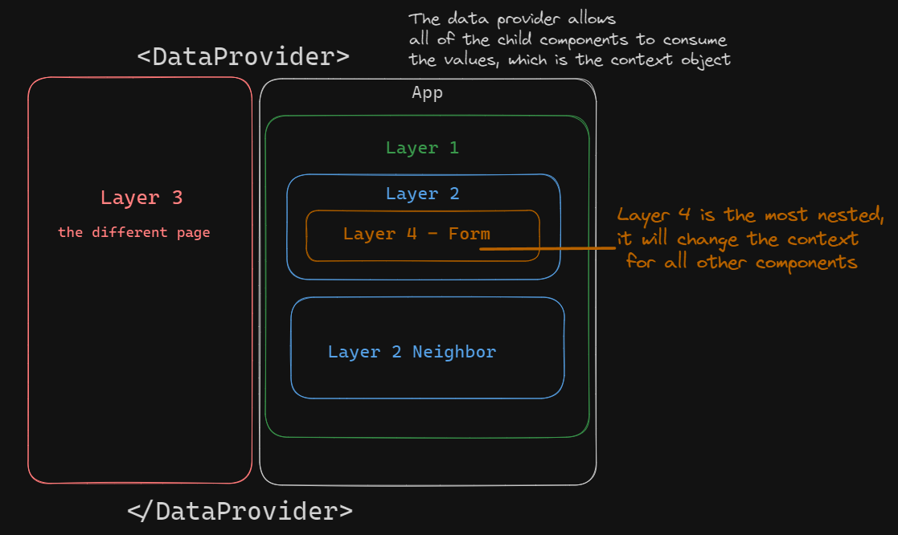

# useContext Hook and Global State

## About Context
- React's Context API  allows you to manage and share state across components without the need to pass props manually through each level of the component tree. It provides a way to create a global state object that can be accessed by any component within the application.
- There are two main parts:
  * Context Object: The context object is created using the `createContext()` function from the React package. It represents the shared state that you want to make available to other components. The context object holds the current state value and provides it to the consuming components.
  * Provider Component: The provider component is responsible for providing the context values to its child components. It wraps a portion of the component tree where you want the context to be used. 
- Folder Structure and Naming Convention: A common practice is to organize your context-related files into a separate folder within your project. You can create a folder named contexts or stores to house your context files. As for naming conventions, using `<resource>Context.js` or `<resource>Store.js` is a common approach. For example, if your context manages user-related data, you can name it `UserContext.js` or `UserStore.js`. 

## Use Cases 

### When to use?
React Context is useful when you have deeply nested components or when you want to share state between components that are not related.  

passing data that can be used in **any component in your application no matter where the component is in the component tree**:
  - theme data
  - user authentication status, a token or user details
  - location data
  - shopping cart

### When not to use?
React context is awesome, do I still need props? It is awesome, but it's not the end-all solution. 

Here are some examples:
- Simple and Local State: If the state you need to manage is simple and limited to a specific component, just use `useState`
- Performance: It's not designed for data that changes often, when frequent state changes occur, it re-renders all the components consuming the context. 
- Small Number of Components: If you need to pass state down a few levels, manually passing props is more straightforward than creating and maintaining a context provider and consumer.
- If you use React Context it can also reduce the reusability of components and lead to more complex logic and harder to maintain codebase.

Keep in mind the use cases for your app and what you need to accomplish. There are plenty more examples of pros and cons for React Context.

## Setting up Context

## Step 1 - creating the context

1. create context using the `createContext` function, pass in the data you want to be used as global state. In this instance, we have an object that has the data we will be manipulating, the `name`, and an empty function, called `setName`. 

* Note: the reason for `setName: () => {}`, it's intially defined as an empty function in the context when created, but within the `DataProvider` we implement the a named function that will be set as the value to the `setName` function in the `Provider` we will create in the next step.

```js
//CONTEXT FILE
import { createContext, useState } from "react";
//step 1
const DataContext = createContext({
    //our default value = 'kangaroos'
    name: 'kangaroos',
    //our provider will have the updated value, in this case a func
    setName: () => {}
})
```
## Step 2 - creating the provider

2. Create a **PROVIDER**, it's a function that returns your `CONTEXT.PROVIDER`. put any value you like on your context provider using the `value` prop, make sure to wrap this `.PROVIDER` around the children

#### example from this repo:
```js
//CONTEXT FILE
//pass in children destructured otherwise it would be props.children
function DataProvider({ children }) {
    //since we want to override the initial context we created, we need state to override 
    const [data, setData] = useState({
        name: 'kangaroos'
    })
    //this is just a function that will take in the input value and will update the state data that lives within our DataProvider
     const updateName = (newData) => {
        setData(newData)
    }
    //these are the values that will be fed to each of the components that are wrapped around the provider
    return (
        //call the context object you created, in this case its named DataContext and then .Provider
        <DataContext.Provider value={{
            // `name` is the property in the context value, which will hold the value of `data`
            name: data, 
            // `setName` is the property in the context value, which will hold the reference to the `updateName` function
            setName: updateName //
        }}>
            {children} //all child components have access to it
        </DataContext.Provider>
    )
}
//export it out
export { DataContext, DataProvider }
```

### More info on the `DataContext.Provider`:

- The `name` property in the context value is used to hold the value of the data state.
- The `setName` property in the context value is used to hold the reference to the `updateName` function. This function can be used by any of the child components to update the global state object.
- `children` refers to the child components that are wrapped within the `DataContext.Provider`. All child components will have access to the context object and its values. We will see that in the next step.

## Step 3 - the provider in the App component

3. Take your created context and wrap the context provider around your component tree. this gives **ALL** the components and its children components, i.e. nested components will have access to the **GLOBAL STATE** Even if they are on different routes, the component as long as it's a child of the `<DataProvider>` component, will have access to the context.

```js
import Layer1 from './components/Layer1'
import { DataProvider } from './context/context'

function App() {
  return (
    <>
      <DataProvider>
        <main>
          <Routes>
            <Route path="/" element={<Layer1 />} />
            <Route path="/layer3" element={<Layer3 />} />
          </Routes>
        </main>
      </DataProvider>
    </>
  );
}
```

## Diagram of the Component Tree



## Step 4 - using the context

4. Read that value within any component by using the ***the context hook***

```js
//import it
import { useContext } from 'react'
import { DataContext } from '../context/context';

//call the hook and pass in the DataContext, this is the context we created
  const dataFromContext = useContext(DataContext);
//destructure the values from the provider, the state & setter
const { name } = dataFromContext;

//use the data in the return like any other state value, in this case, it's a object of name with a property of name. Bad naming convention, sorry about that 
return (
    <div>Layer1 data from context = {name.name}
        <Layer2 />
        <Layer2neighbor />
    </div>
)
```

## Step 5 - updating the global state
- Import the context and `useContext` hook, we will also need the `useState` hook since our component will have an input.

```js
import { useState } from "react";
import { useContext } from "react";
import { DataContext } from "../context/context";
```
- Instantiate the context.

```js
//context setup
const dataFromContext = useContext(DataContext);
const { name, setName } = dataFromContext;
//local state
const [layerFourState, setLayerFourState] = useState(name);
```

- create a function that that when submitted, will update the state
```js
  const handleSubmit = (e) => {
    e.preventDefault();
      // setName from the context file, overrides the global state, and updates the 'name' property with the value of 'layerFourState'
    setName({ ...name, name: layerFourState });
  };
```
- `setName` is the function obtained from the context file, which is used to override the global state.
- The `setName` function is called with a new object that spreads the existing name state and updates the `name` property with the value of `layerFourState`.
- By calling `setName`, the global state will be re-rendered with the updated value of the `name` property.


## Use this project
1. clone down this project to your machine
1. open your terminal
1. `cd` into the `context-demo`
1. run `npm i` or `npm install` once in the `context-demo` directory
1. to start the project `npm run dev`

## Technologies Used:
This React projected was created with Vite. [Vite Docs](https://vitejs.dev/)
- React - [React Docs](https://react.dev/)
- React-Router-Dom - [React Router Dom Docs](https://reactrouter.com/en/main)


## Questions? Comments?
If you have any questions, feedback, or suggestions, please feel free to reach out to me via email at ronniemarkrios@gmail.com. You can also open an issue on the project's repository on GitHub here. I had a lot of fun creating this project, writing about React Context, and explaining it to new developers


##  Why certain naming conventions?
- the data and variable names were written as generic as possible in the `context.jsx` file, feel free to name them around the data resource you would be using.
-  The `Layer` components are named  to show you will have access to global state no matter where the component exists in the component tree.
- I don't have any rhyme or reason why I set the intial value to `kangaroos`. 
